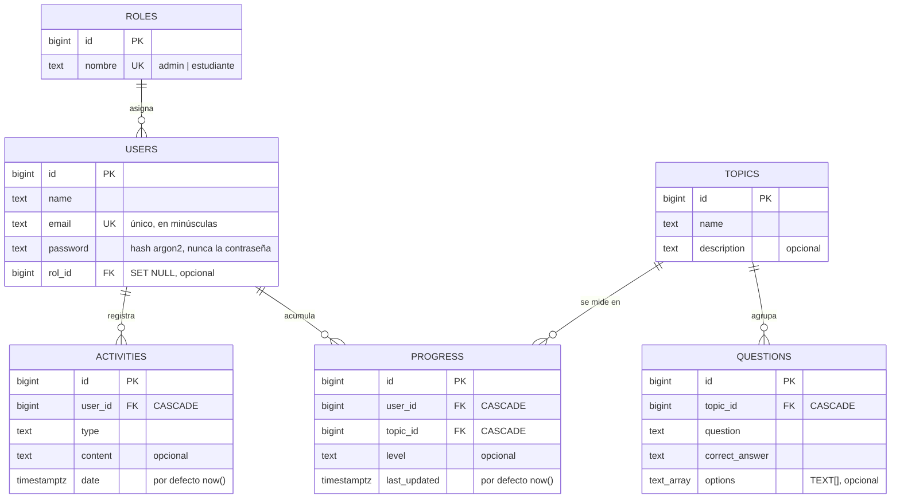
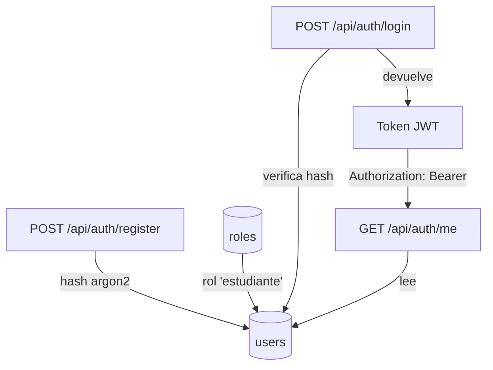
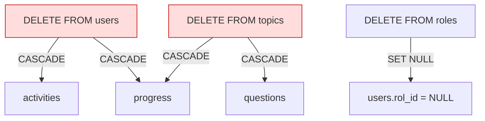

# Diagrama de la base de datos - StudyIA

Diagrama entidad-relación de las 6 tablas. El detalle de cada columna está en
[`schema.md`](./schema.md).

## Diagrama

## Cómo leerlo

**`||--o{`** significa "uno tiene muchos". Por ejemplo, `ROLES ||--o{ USERS`:
un rol lo tienen muchos usuarios y cada usuario tiene un solo rol.

**`PK`** = llave primaria. **`FK`** = llave foránea. **`UK`** = valor único.
**`CASCADE`** = si se borra la fila apuntada, esta fila se borra sola.
**`SET NULL`** = si se borra la fila apuntada, esta columna queda en `NULL`.

## Flujo de autenticación

## Qué se borra en cascada

