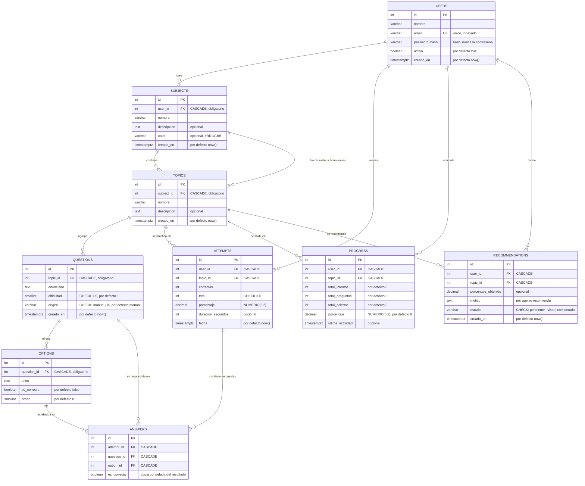
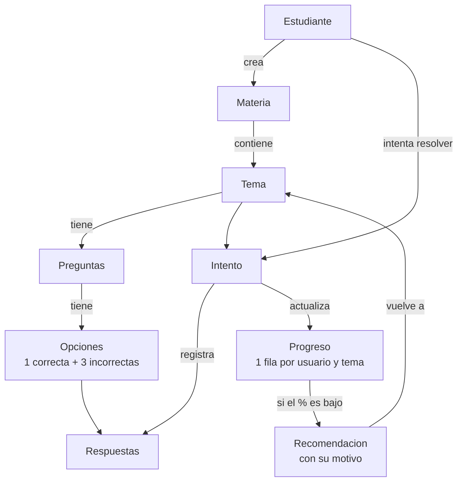
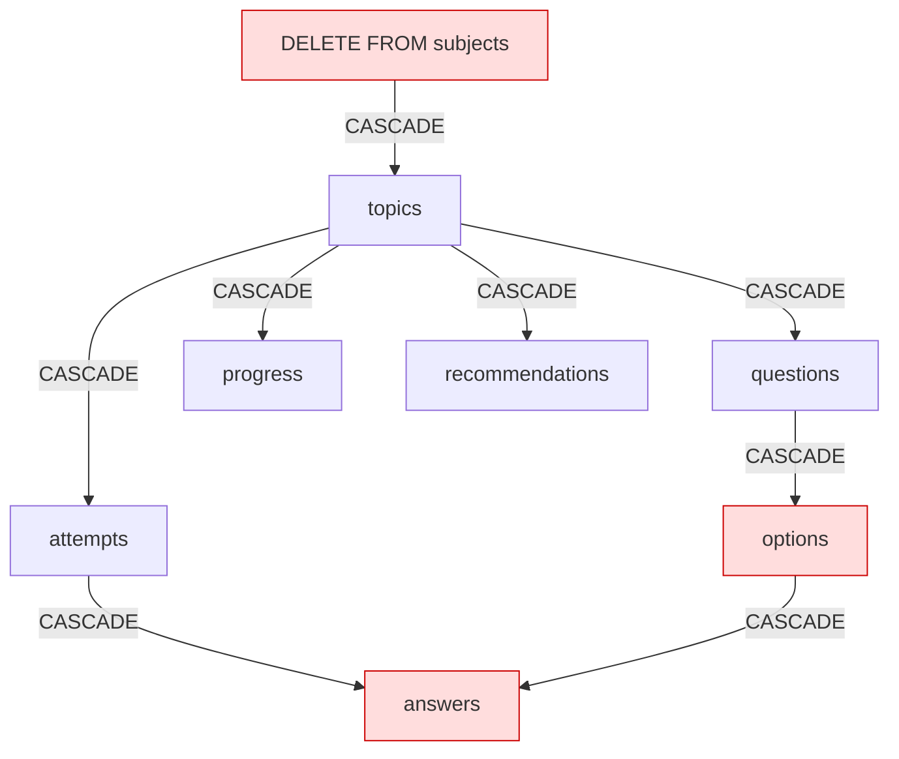

# Diagrama de la base de datos - StudyIA

Diagrama entidad-relacion de las 9 tablas. El detalle de cada columna esta en
[`schema.md`](./schema.md).

## Diagrama

## Como leerlo

**`||--o{`** significa "uno tiene muchos". Por ejemplo, `USERS ||--o{ SUBJECTS`:
un usuario tiene muchas materias, y cada materia pertenece a un solo usuario.

**`PK`** = llave primaria (identificador unico de la fila).
**`FK`** = llave forena (apunta a otra tabla).
**`UK`** = llave unica (no se puede repetir).
**`CASCADE`** = si se borra la fila apuntada, esta fila se borra sola.
**`CHECK`** = regla que valida un valor allowed range o una lista.
Las comillas en los atributos son comentarios explicativos.

## Diagrama de flujo: como se usa un tema

## Diagrama de flujo: por que se borra todo en cascada

Un solo `DELETE` limpia las 6 tablas dependientes. Por eso `answers` tiene
tambien `CASCADE` hacia `questions` y `options`: borrar una pregunta
**destruye el historial de respuestas**. Ver el aviso en
[`schema.md`](./schema.md), seccion 2.
